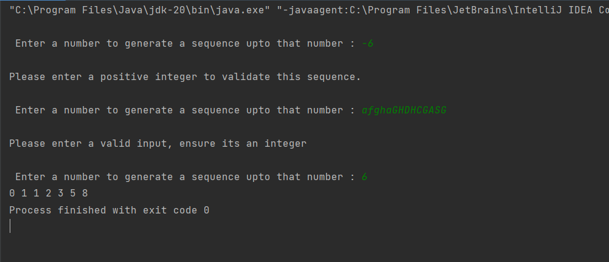
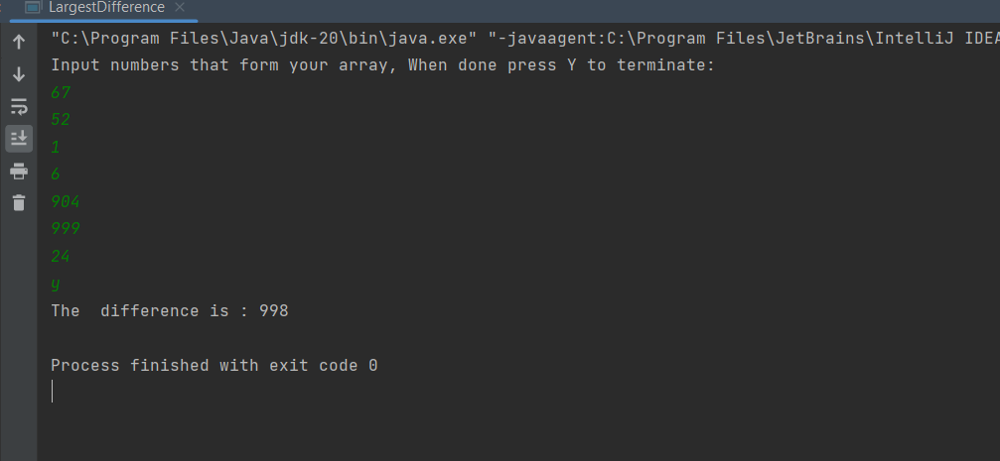

# Code Assessment Turkey

# TASK ONE - Fibonnacci.java
### Write a Java program that generates a Fibonacci sequence. The program should ask the user for an input number and then print the Fibonacci sequence up to that number.

## Assessment Evaluation Criteria:
- Correctness of the program: Does it generate the correct Fibonacci sequence for the given
input number?
- Code quality: Is the code well-structured, modular, and readable?
- Input validation: Does the program handle invalid user input appropriately?
- Error handling: Does the program gracefully handle errors and display meaningful error
messages?
- Optimization: Does the program implement any optimization techniques to efficiently generate
the Fibonacci sequence?

### A snapshot of error handling and display of meaningful error messages

# TASK TWO  - LargestDifference.java
### Implement a function in Java programming language that takes a list of integers as input and returns the largest difference between any two numbers in the list. For example, given the input [1, 9, 3,7], the function should return 8, as the largest difference is between 1 and 9.
  
### Implementation of the solution

# TASK THREE - employee_query.sql

### Assume you have a database table called "employees" with the following columns: "id" (integer), "name"(text), "age" (integer), and "salary" (float). Write a SQL query that selects all employees whose age isabove 30 and salary is above $50,000.

### Requirements:
Write the SQL query that satisfies the given conditions.
Assume the database is already set up and accessible.
### Evaluation Criteria:
- Correctness of the SQL query: Does it select the employees that meet the specified conditions?
- Query efficiency: Is the query optimized for performance?
- Clarity and readability: Is the query easy to understand and maintain?
- Familiarity with SQL: Does the query demonstrate a good understanding of SQL syntax and concepts?
### Solution
-Combine WHERE && AND clause to meet the conditions.
-The query selects only the necessary columns instead of using selecting All.
# TASK 4 
### Identification of bug
### Evaluation Criteria:
- Identification of the bug: Does the candidate correctly identify the issue in the code?
- Corrected code: Does the candidate provide a corrected version of the code that calculates the
average correctly?
- Problem-solving skills: Does the candidate approach the debugging process in a systematic
manner?
- Code quality: Is the corrected code well-structured, modular, and readable?

### Solution
- The possible error in the code  is caused by  ( total / numbers.length) integer division
- To fix this error, the division is done by using floating point division

